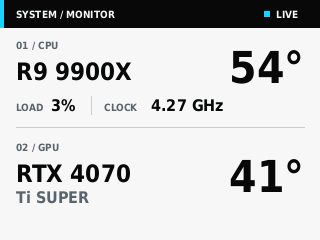

# Deepcool LM 系列 Linux LCD 驱动

这是一个通过逆向 Windows 软件的 USB 协议实现的 Linux 驱动，用于在 Deepcool LM 系列水冷屏幕上显示系统监控画面。目前已在 LM240 和 LM360 上验证，设备 VID:PID 为 `3633:0026`，屏幕分辨率为 320x240。



## 功能

- 显示 CPU/GPU 型号、温度、CPU 使用率和频率
- 支持 AMD、Intel 和 NVIDIA 的常见传感器来源
- 支持浅色/深色监控主题动态切换、纯色画面和亮度调节
- 通过 systemd 持续运行
- CLI 通过 Unix socket 控制已运行的服务，避免重复占用 USB
- 提供不访问 USB 的 320x240 桌面调试预览器

项目不再提供自定义图片上传功能。

## 依赖

正式驱动需要：

- Python 3
- PyUSB
- psutil
- Pillow
- lm_sensors
- DejaVu Sans 字体
- pciutils
- usbutils

Arch Linux：

```bash
sudo pacman -S python-pyusb python-psutil python-pillow lm_sensors ttf-dejavu pciutils usbutils
```

仓库内调试预览器额外需要 PySide6：

```bash
sudo pacman -S pyside6
```

## 安装

### Arch 软件包

```bash
makepkg -si
```

`PKGBUILD` 将程序安装到 `/usr/bin/deepcool-lm`，共享模块安装到 `/usr/lib/deepcool-lm`。

### 通用安装脚本

```bash
sudo ./install.sh
```

该安装器将程序安装到 `/usr/local/bin/deepcool-lm`，共享模块安装到 `/usr/local/lib/deepcool-lm`，并生成匹配该路径的 systemd unit。

温度传感器首次使用前通常还需要：

```bash
sudo sensors-detect
sudo systemctl enable --now lm_sensors
```

## 使用

启动或切回实时监控：

```bash
sudo deepcool-lm monitor
sudo deepcool-lm monitor --interval 1
```

动态切换监控主题：

```bash
sudo deepcool-lm theme light
sudo deepcool-lm theme dark
```

主题由运行中的监控服务保存到 `/var/lib/deepcool-lm/theme`，切换后下一帧立即生效，不会重启服务或重新占用 USB。服务重启后自动恢复上次使用的主题；首次运行或状态文件无效时使用浅色主题。

显示纯色：

```bash
sudo deepcool-lm solid --color 0 0 0
sudo deepcool-lm solid --color 255 0 0
```

调节亮度：

```bash
sudo deepcool-lm brightness up
sudo deepcool-lm brightness down
```

管理服务：

```bash
sudo systemctl enable --now deepcool-lm
sudo systemctl status deepcool-lm
sudo journalctl -u deepcool-lm -f
```

卸载通用安装脚本安装的文件：

```bash
sudo ./uninstall.sh
```

## 调试预览器

预览器只在仓库内使用，不安装到系统，不导入 PyUSB，也不会连接正式驱动的 `/var/run/deepcool-lm.sock`。它调用与正式驱动相同的 `render_monitor_framebuffer()` 生成最终 153,600 字节 RGB565 payload，再把该 payload 解码到桌面窗口；因此预览器不维护第二套布局算法，显示的是 USB 发送前的最终帧内容。

启动固定 320x240 的实时窗口：

```bash
./deepcool-lm-preview run
```

覆盖数据以检查极端布局：

```bash
./deepcool-lm-preview set \
  cpu_temp=90 \
  cpu_percent=100 \
  cpu_freq=5.2 \
  'cpu_model=Ryzen 9 9950X3D' \
  gpu_temp=78 \
  gpu_brand=NVIDIA \
  'gpu_model=RTX 5090'
```

重新采集实时数据并等待画面更新：

```bash
./deepcool-lm-preview refresh
```

保存当前原始 320x240 PNG：

```bash
./deepcool-lm-preview screenshot
./deepcool-lm-preview screenshot --output /tmp/deepcool-lm-preview.png
```

不指定 `--output` 时，截图按本地时间保存为仓库内的 `previews/preview-YYYYMMDD-HHMMSS-ffffff.png`。该目录已加入 `.gitignore`。截图直接保存当前 PIL 画面，不包含窗口边框，也不受桌面缩放影响。

清除覆盖并停止：

```bash
./deepcool-lm-preview reset
./deepcool-lm-preview stop
```

用于自动验证的无窗口模式：

```bash
./deepcool-lm-preview run --headless --interval 0 --set cpu_temp=72
```

## 架构

- `deepcool-lm`：USB 协议、正式 IPC、显示状态和 CLI
- `deepcool_lm_system.py`：不依赖 USB 的系统信息采集
- `deepcool_lm_display.py`：不读取系统信息的 PIL 绘制和 RGB565 编码
- `deepcool-lm-preview`：仓库内 PySide6 调试窗口和用户态控制 socket
- `deepcool-lm.service`：systemd 后台监控服务
- `PKGBUILD`、`.SRCINFO`、`deepcool-lm.install`：Arch 软件包元数据和生命周期钩子
- `install.sh`、`uninstall.sh`：独立的通用安装流程

修改布局时编辑 `deepcool_lm_display.py`。`render_monitor_framebuffer()` 是正式驱动和预览器共用的最终帧入口，必须返回 153,600 字节的小端 RGB565 数据；预览器只通过 `framebuffer_to_rgb_image()` 解码这份数据。

## 协议约束

- USB VID:PID：`3633:0026`
- OUT endpoint：`0x01`
- 分辨率：320x240
- 像素格式：RGB565 little-endian
- 帧头：13 字节 `aa 08 00 00 01 00 58 02 00 2c 01 bc 11`
- 帧缓冲区：`320 * 240 * 2 = 153600` 字节
- 正式 IPC socket：`/var/run/deepcool-lm.sock`

这些数值来自设备协议，不应作为普通界面常量修改。

## 开发验证

```bash
python -m unittest discover -s tests -v
python -m py_compile deepcool-lm deepcool_lm_display.py deepcool_lm_system.py deepcool-lm-preview
./deepcool-lm --help
./deepcool-lm-preview --help
bash -n install.sh uninstall.sh
systemd-analyze verify deepcool-lm.service
diff -u .SRCINFO <(makepkg --printsrcinfo)
makepkg -f
```

真实监控、纯色和亮度测试需要连接设备并具备 USB 权限；预览器测试不能替代硬件回归。

## 故障排查

确认设备：

```bash
lsusb | grep 3633:0026
```

确认传感器：

```bash
sensors
```

查看服务日志：

```bash
sudo journalctl -u deepcool-lm -n 50
```
